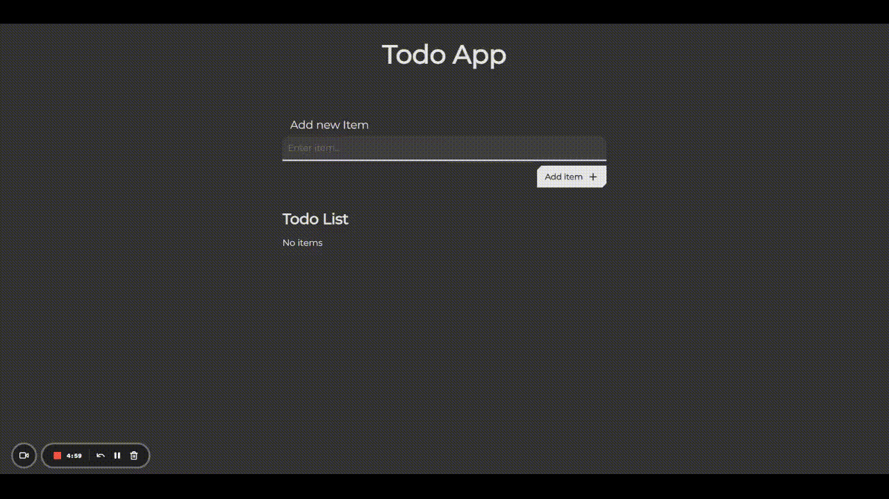

# Todo App

    

## Description

A simple React base Todo app that allows the user to create a list of todos. The list is stored on [localStorage](https://developer.mozilla.org/en-US/docs/Web/API/Window/localStorage), so that the tasks and their completions status stays stored. The user is also able to remove a task if the task is no longer needed.

## Features

- Add task: adds a task to the list of tasks the user created
- Mark completed: allows the user to place a checkmark on the task he is done with
- Remove task: delete the taske that are no longer needed
- Stored list: most up2date list is stored on localStorage

## Live demo

You can try out the Todo-app by visiting the [live demo](https://zack1808.github.io/todo-app/)

## How to run the app locally

If you want to run the app localy:

#### 1. Clone the repository

- HTTPS: `git clone https://github.com/Zack1808/todo-app.git`
- SSH: `git clone git@github.com:Zack1808/todo-app.git`
- GitHub CLI: `gh repo clone Zack1808/todo-app`

#### 2. Enter the project directory

`cd todo-app`

#### 3. Allow the app to install the necessary packages (Node.js has to be installed on the device)

`npm install`

#### 4. Start the app

`npm start`

After execution, the localhost server will startup and a browser window will open, previewing the Todo app.

## Contribution

Contributions to the Todo app project are welcome. If you find any issues or want to add new features, feel free to create a pull request. Make sure to follow the project's coding conventions and provide detailed information about your changes.

## Contact

If you have any questions or suggestions, you can reach me via:

- Mail: jeanpierrenovak23@gmail.com
- My portfolio: [jeanpierrenovak.netlify.app](https://jeanpierrenovak.netlify.app)

---

Stay organized!
